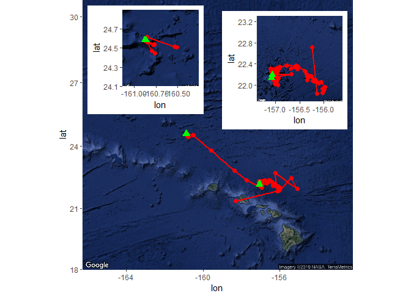
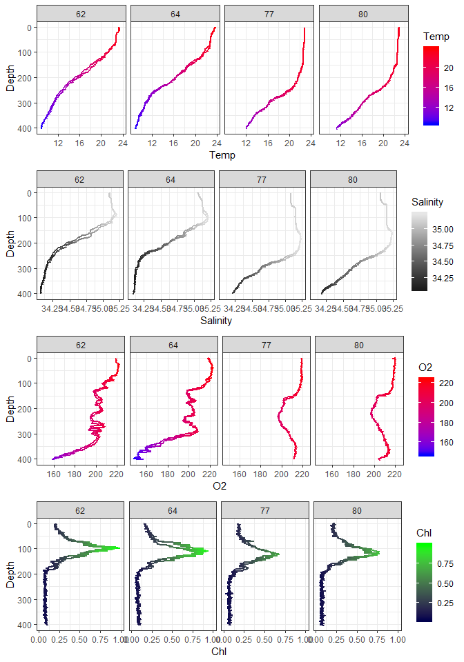

FalkorMetaDataVis
================
wkumler
August 13, 2019

Spatial map
-----------

Interactive cruise track
------------------------

<!--html_preserve-->

<!--/html_preserve-->
Cruise track with max depth of CTD cast
---------------------------------------

<!--html_preserve-->

<!--/html_preserve-->
Gyre rendering
--------------

### Station 62, April 3rd, 3pm

### Station 64, April 4rd, 4am

### Station 77, April 7th, 4pm

### Station 80, April 8th, 4am

Sampled stations CTD data
-------------------------

